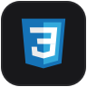
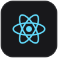
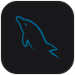
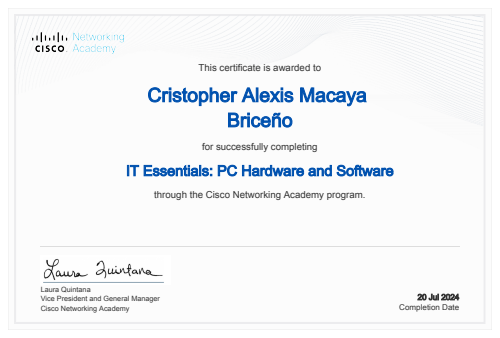
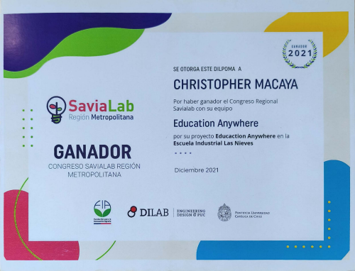
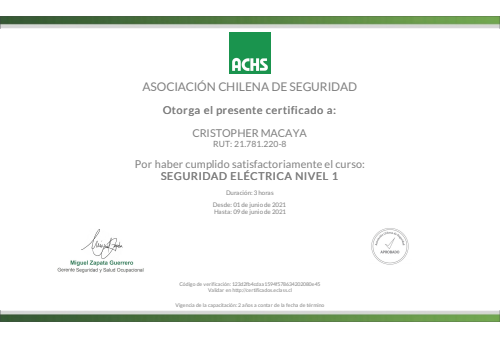

<!-- BANNER PRINCIPAL -->

  
  
  <!-- ENCABEZADO Y PERFIL -->
  
  
<em>Ingeniero en Informática | Hardware & Software Integration</em>

  <!-- REDES SOCIALES Y ACCESOS RÁPIDOS -->
  
  
  
  
  
  
  
  
   
  
  <!-- METRICAS EN TIEMPO REAL: VISITAS, FORKS Y ESTRELLAS -->
  
  
  

 

---

<!-- SOBRE MÍ -->

<h2 id="sobre-mi" align="center">🙋‍♂️ Sobre Mí</h2>

  
Experto en traducir requerimientos lógicos en soluciones tecnológicas tangibles. Combino el rigor del análisis de circuitos con la agilidad del desarrollo de software para crear aplicaciones y análisis de datos de alto impacto.

  
Me motiva la innovación práctica: resolver desafíos reales mediante una ingeniería creativa y disciplinada.

 

<!-- APTITUDES Y PILARES -->

<h2 id="aptitudes-y-pilares" align="center">💡 Aptitudes y Pilares</h2>

  <table width="100%" style="border-collapse: collapse; border: none;">
    <tr align="center">
      <td width="33%" valign="top" style="padding: 10px;">
        

            
          
Responsable, puntual y con experiencia liderando equipos bajo presión.

        

      </td>
      <td width="33%" valign="top" style="padding: 10px;">
        

            
          
Ganador de SaviaLab 2021, donde aprendí que la tecnología debe tener un impacto real.

        

      </td>
      <td width="33%" valign="top" style="padding: 10px;">
        

            
          
Enriqueciendo mis conocimientos para roles de liderazgo técnico como Scrum Master.

        

      </td>
    </tr>
  </table>

 

---

<!-- ARSENAL TECNOLÓGICO -->

<h2 id="arsenal-tecnologico" align="center">🛠️ Arsenal Tecnológico</h2>

  
<b>Lenguajes & Desarrollo Frontend</b>

  

    
    
    
    
    
    
    
    
  

  
<b>Bases de Datos, Analítica & Herramientas</b>

  

    
    
    
    
    
  

  
<b>Ecosistema Microsoft & Power Platform</b>

  

    
    
    
    
    
  

 

---

<!-- CERTIFICACIONES Y LOGROS -->

<h2 id="certificaciones" align="center">📜 Certificaciones & Logros</h2>

<i>Haz clic sobre la imagen de cualquier certificado para ver el documento oficial en alta resolución:</i>

<!-- DIPLOMAS DESTACADOS (3 VISIBLES POR DEFECTO) -->

  <table width="100%" style="border-collapse: collapse;">
    <tr align="center">
      <td width="33%" valign="top" style="padding: 10px;">
        

          
            
          <b>Power BI Business Intelligence</b> 
          <small>🏢 Daxus Latam (2025)</small>  
          
        

      </td>
      <td width="33%" valign="top" style="padding: 10px;">
        

          
            
          <b>Cisco IT Essentials</b> 
          <small>🌐 Cisco Networking Academy (2024)</small>  
          <a href="assets/certificates/Cisco/Diploma-1.pdf" target="_blank">[D1]</a>
          <a href="assets/certificates/Cisco/Diploma-2.pdf" target="_blank">[D2]</a>
          <a href="assets/certificates/Cisco/Diploma-3.pdf" target="_blank">[D3]</a>
          <a href="assets/certificates/Cisco/Insignia.png" target="_blank">[🖼️ Insignia]</a>
        

      </td>
      <td width="33%" valign="top" style="padding: 10px;">
        

          
            
          <b>Introducción a Python</b> 
          <small>🏛️ Santander Open Academy (2025)</small>  
          
        

      </td>
    </tr>
  </table>

<!-- BOTÓN DESPLEGABLE "VER MÁS CERTIFICACIONES" -->
 

<b>📜 Ver más Certificaciones & Logros (5 adicionales)</b>

 

  <table width="100%" style="border-collapse: collapse;">
    <tr align="center">
      <td width="33%" valign="top" style="padding: 10px;">
        

          
            
          <b>Desarrollo de Apps Iniciales</b> 
          <small>🎓 INACAP (2025)</small>  
          
        

      </td>
      <td width="33%" valign="top" style="padding: 10px;">
        

          
            
          <b>Infraestructura TI Segura</b> 
          <small>🎓 INACAP (2025)</small>  
          
        

      </td>
      <td width="33%" valign="top" style="padding: 10px;">
        

          
            
          <b>Electricidad y Automatización</b> 
          <small>🎓 INACAP (2022)</small>  
          
        

      </td>
    </tr>
    <tr align="center">
      <td width="33%" valign="top" style="padding: 10px;">
        

          
            
          <b>Ganador Concurso SaviaLab</b> 
          <small>💡 SaviaLab / Innovación (2021)</small>  
          
        

      </td>
      <td width="33%" valign="top" style="padding: 10px;">
        

          
            
          <b>Seguridad Eléctrica Nivel 1</b> 
          <small>🛡️ ACHS (2021)</small>  
          
        

      </td>
      <td width="33%" valign="top" style="padding: 10px;">
        <!-- Espacio libre -->
      </td>
    </tr>
  </table>

 

---

<!-- PROYECTOS DESTACADOS -->

<h2 id="proyectos-destacados" align="center">🚀 Proyectos Destacados</h2>

<!-- PROYECTOS PRINCIPALES (4 VISIBLES POR DEFECTO) -->

  <table width="100%" style="border-collapse: collapse;">
    <tr align="center">
      <td width="50%" valign="top" style="padding: 10px;">
        

          <h3>💡 Education Anywhere</h3>
          
<b>Problema:</b> Conectividad limitada en zonas rurales durante pandemia. <b>Solución:</b> App educativa equitativa sin necesidad de internet constante.

          

            
            
            
          

           
          
          
        

      </td>
      <td width="50%" valign="top" style="padding: 10px;">
        

          <h3>📊 Calculadora de Ponderaciones</h3>
          
<b>Problema:</b> Promediar notas de ramos con porcentajes y exámenes. <b>Solución:</b> Herramienta intuitiva que automatiza el cálculo de notas ponderadas.

          

            
            
            
          

           
          
        

      </td>
    </tr>
    <tr align="center">
      <td width="50%" valign="top" style="padding: 10px;">
        

          <h3>🔢 Convertidor de Bases Numéricas</h3>
          
<b>Problema:</b> Conversión de distintas bases numéricas en redes de datos. <b>Solución:</b> Aplicación portable `.exe` ejecutable en CMD para cálculo rápido.

          

            
            
          

           
          
        

      </td>
      <td width="50%" valign="top" style="padding: 10px;">
        

          <h3>⬇️ Downloader MP3 / MP4</h3>
          
<b>Problema:</b> Descargar audio/video de YouTube sin anuncios molestos. <b>Solución:</b> Script ejecutable en CMD para descargas directas.

          

            
            
          

           
          
        

      </td>
    </tr>
  </table>

<!-- BOTÓN DESPLEGABLE "VER MÁS PROYECTOS (INCLUYE UNIVERSITARIOS)" -->
 

<b>🚀 Ver más Proyectos (Incluye Proyectos Universitarios)</b>

 

  <table width="100%" style="border-collapse: collapse;">
    <tr align="center">
      <td width="50%" valign="top" style="padding: 10px;">
        

          <h3>🍽️ Come y Calla (Versión Tobyas)</h3>
          
<b>Descripción:</b> Web-App estática e interactiva para gestionar una invitación personalizada de 'La Divina Comida'. Mobile-First con animaciones scroll AOS.js.

          

            
            
            
          

           
          
        

      </td>
      <td width="50%" valign="top" style="padding: 10px;">
        

          <h3>⏲️ TodoList App</h3>
          
<b>Problema:</b> Consolidación de conocimientos fullstack backend/frontend. <b>Solución:</b> Web app de gestión de tareas escalable con persistencia.

          

            
            
            
          

           
          
        

      </td>
    </tr>
    <tr align="center">
      <td width="50%" valign="top" style="padding: 10px;">
        

          <h3>🎓 Eva 3 Backend (INACAP)</h3>
          
<b>Descripción:</b> Sistema de gestión de biblioteca con desarrollo de operaciones CRUD completas para asignaturas universitarias.

          

            
            
            
          

           
          
        

      </td>
      <td width="50%" valign="top" style="padding: 10px;">
        <!-- Espacio libre -->
      </td>
    </tr>
  </table>

 

---

<!-- CONTACTO (DISEÑO MEJORADO VISUALMENTE) -->

<h2 id="contacto" align="center">📫 Contacto</h2>

  

    
Si estás interesado en colaborar o tienes alguna pregunta, ¡no dudes en contactarme!

    
Puedes escribirme directamente a:  
      
    

     
    
  

 

---

<!-- ESTADÍSTICAS GITHUB (DISEÑO MEJORADO VISUALMENTE) -->

<h2 id="estadisticas-github" align="center">📊 Estadísticas de GitHub</h2>

  <table style="border-collapse: collapse; border: none;">
    <tr align="center">
      <td style="padding: 5px;">
        
      </td>
      <td style="padding: 5px;">
        
      </td>
    </tr>
  </table>
   
  

 

---

<!-- FOOTER DE DERECHOS Y CRÉDITOS -->

  

    
      © 2025 - 2026 <b>Cristopher Macaya (vTriiXxy)</b> • Todos los derechos reservados. 
      Diseñado & Creado con ❤️ | Protegido bajo <a href="LICENSE"><b>Licencia MIT</b></a>
    
  

