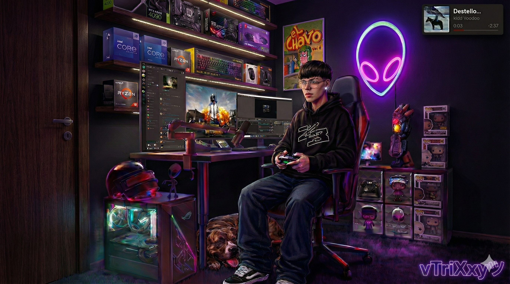

<!-- 1. FOTO DE PORTADA (BANNER AUTOMÁTICO) -->

<!-- 2. REDES SOCIALES -->

  
  
  
  
  
  
  
   
  

 

<!-- ÍNDICE (DESPLEGABLE) -->

🧭 Ver Índice de Contenidos

 
  
  
  
  
  
  
 

 

<!-- 3. SOBRE MÍ -->

  <em>Ingeniero en Informática con pasión por conectar <b>Hardware y Software</b> 🔌💻</em>
   
   
  
Mi background en <b>Electrónica</b> me dio una base sólida en lógica y precisión, principios que ahora aplico en el <b>Desarrollo de Software</b> y <b>Análisis de Datos</b> para crear soluciones tecnológicas completas y eficientes.

  
Busco constantemente resolver problemas de formas creativas y no me conformo con lo básico.

 

  <table width="80%">
    <tr align="center">
      <td width="33%">
        🚀
         
        <b>Actitud Proactiva</b>
         
        Responsable, puntual y con experiencia liderando equipos bajo presión.
      </td>
      <td width="33%">
        💡
         
        <b>Innovación con Propósito</b>
         
        Ganador de SaviaLab 2021, donde aprendí que la tecnología debe ser útil.
      </td>
      <td width="33%">
        🔭
         
        <b>Visión a Futuro</b>
         
        Enriqueciendo mis conocimientos y preparándome para roles de liderazgo técnico como Scrum Master.
      </td>
    </tr>
  </table>

  <h3>🎧 Coding Vibes</h3>
  

<!-- 4. TECNOLOGÍAS Y LENGUAJES -->

<h2 align="center" id="arsenal-tecnologico">🛠️ Arsenal Tecnológico</h2>

  

<!-- 5. CERTIFICADOS E INSIGNIAS -->

<h2 align="center" id="certificaciones">📜 Certificaciones & Logros</h2>

Haz clic para ver la lista de certificaciones

 

  <table width="80%">
    <thead>
      <tr align="center">
        <th>Certificado</th>
        <th>Emisor</th>
        <th>Año</th>
      </tr>
    </thead>
    <tbody>
      <tr align="center">
        <td><a href="assets/certificates/Powe%20BI%20Daxus%20Latam/Diploma-1.pdf" target="_blank">📊 Power BI Business Intelligence</a></td>
        <td>🏢 Daxus Latam</td>
        <td>2025</td>
      </tr>
      <tr align="center">
        <td><a href="assets/certificates/Santander%20Open%20Academy/Diploma-1.pdf" target="_blank">🐍 Introduccion a Python</a></td>
        <td>🏛️ Santander Open Academy</td>
        <td>2025</td>
      </tr>
      <tr align="center">
        <td><a href="assets/certificates/Desarrollo%20de%20Aplicaciones%20Iniciales/Diploma-1.pdf" target="_blank">🔧 Desarrollo de Aplicaciones Iniciales</a></td>
        <td>🎓 INACAP</td>
        <td>2025</td>
      </tr>
      <tr align="center">
        <td><a href="assets/certificates/Infraestructura%20TI%20Segura/Diploma-1.pdf" target="_blank">🔒 Infraestructura TI Segura</a></td>
        <td>🎓 INACAP</td>
        <td>2025</td>
      </tr>
      <tr align="center">
        <td>
          🏅 IT Essentials (Insignia Verificada)
          <a href="assets/certificates/Cisco/Diploma-1.pdf" target="_blank">[D1]</a>
          <a href="assets/certificates/Cisco/Diploma-2.pdf" target="_blank">[D2]</a>
          <a href="assets/certificates/Cisco/Diploma-3.pdf" target="_blank">[D3]</a>
          <a href="assets/certificates/Cisco/Insignia.png" target="_blank">[Insignia]</a>
        </td>
        <td>🌐 Cisco Networking Academy</td>
        <td>2024</td>
      </tr>
      <tr align="center">
        <td><a href="assets/certificates/Electricidad%20y%20Automatizacion%20INACAP/Diploma-1.pdf" target="_blank">⚡ Electricidad y Automatización</a></td>
        <td>🎓 INACAP</td>
        <td>2022</td>
      </tr>
      <tr align="center">
        <td><a href="assets/certificates/Savialab/Diploma-1.pdf" target="_blank">🏆 Ganador Concurso SaviaLab</a></td>
        <td>💡 SaviaLab / Innovación</td>
        <td>2021</td>
      </tr>
      <tr align="center">
        <td><a href="assets/certificates/ACHS/Diploma-1.pdf" target="_blank">⚡ Seguridad Eléctrica Nivel 1</a></td>
        <td>🛡️ ACHS</td>
        <td>2021</td>
      </tr>
    </tbody>
  </table>

<!-- 6. PROYECTOS DESTACADOS (Iniciativa Propia) -->

<h2 align="center" id="proyectos-destacados">🚀 Proyectos Destacados</h2>

  <table width="80%">
    <thead>
      <tr align="center">
        <th>Proyecto</th>
        <th>Descripción</th>
        <th>Tecnologías</th>
      </tr>
    </thead>
    <tbody>
      <tr align="center">
        <td>🏆 [Education Anywhere](#)</td>
        <td>Ganador SaviaLab. Solución tecnológica para acceso educativo.</td>
        <td>Innovación, IoT</td>
      </tr>
      <tr align="center">
        <td>📊 [Dashboards BI](#)</td>
        <td>Visualización de KPIs estratégicos para toma de decisiones.</td>
        <td>Power BI, DAX</td>
      </tr>
      <tr align="center">
        <td>🌐 [Web Freelance](#)</td>
        <td>Sitios web responsivos desarrollados para clientes locales.</td>
        <td>React, JS, HTML</td>
      </tr>
    </tbody>
  </table>

<!-- 7. PROYECTOS UNIVERSITARIOS (Desplegables para mantener orden) -->

<h2 align="center" id="proyectos-universitarios">🎓 Proyectos Universitarios (INACAP)</h2>

Repositorios de evaluaciones y laboratorios organizados por área.

<!-- SUBSECCIÓN 1: BACKEND -->

<b>☕ Backend & Programación (Java / Kotlin)</b> (Click para ver)

 

  <table width="80%">
    <thead>
      <tr align="center">
        <th>Repositorio</th>
        <th>Descripción</th>
        <th>Lenguaje</th>
      </tr>
    </thead>
    <tbody>
      <tr align="center">
        <td>📂 [Evaluacion-POO-1](#)</td>
        <td>Sistema de gestión de ventas usando herencia.</td>
        <td>Java</td>
      </tr>
      <tr align="center">
        <td>📂 [Calculadora-Kotlin](#)</td>
        <td>App móvil básica de operaciones matemáticas.</td>
        <td>Kotlin</td>
      </tr>
    </tbody>
  </table>

<!-- SUBSECCIÓN 2: WEB -->

<b>🌐 Desarrollo Web Front-End</b> (Click para ver)

 

  <table width="80%">
    <thead>
      <tr align="center">
        <th>Repositorio</th>
        <th>Descripción</th>
        <th>Tecnologías</th>
      </tr>
    </thead>
    <tbody>
      <tr align="center">
        <td>📂 [Landing-Page-Tarea](#)</td>
        <td>Maquetación semántica y estilos.</td>
        <td>HTML/CSS</td>
      </tr>
      <tr align="center">
        <td>📂 [Formulario-JS](#)</td>
        <td>Validación de datos con JavaScript.</td>
        <td>JS</td>
      </tr>
    </tbody>
  </table>

<!-- SUBSECCIÓN 3: DATOS -->

<b>🗄️ Bases de Datos</b> (Click para ver)

 

  <table width="80%">
    <thead>
      <tr align="center">
        <th>Repositorio</th>
        <th>Descripción</th>
        <th>Motor</th>
      </tr>
    </thead>
    <tbody>
      <tr align="center">
        <td>📂 [Modelado-Relacional](#)</td>
        <td>Script SQL de creación de tablas.</td>
        <td>SQL Server</td>
      </tr>
      <tr align="center">
        <td>📂 [Consultas-Avanzadas](#)</td>
        <td>Ejercicios de Joins y Stored Procedures.</td>
        <td>Oracle</td>
      </tr>
    </tbody>
  </table>

<!-- 8. CONTACTO -->

<h2 align="center" id="contacto">📫 Contacto</h2>

  
    
  Si estás interesado en colaborar o tienes alguna pregunta, ¡no dudes en contactarme!
   
  Puedes escribirme a: <a href="mailto:cris.macaya.91@gmail.com"><b>cris.macaya.91@gmail.com</b></a> 📧

<!-- FOOTER ESTADÍSTICAS -->
<h2 align="center" id="estadisticas-github">📊 Estadísticas de GitHub</h2>

  
  
    
  

